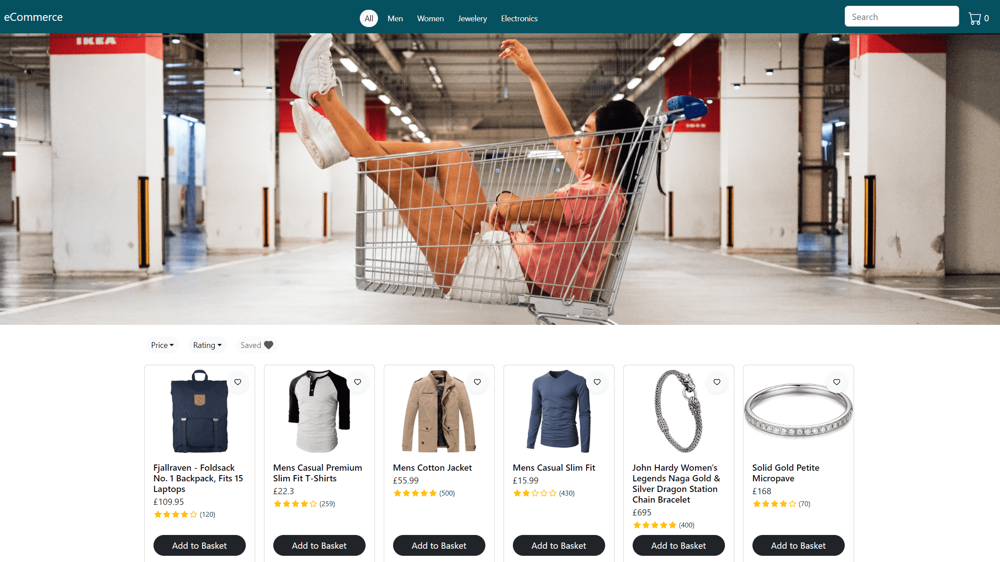
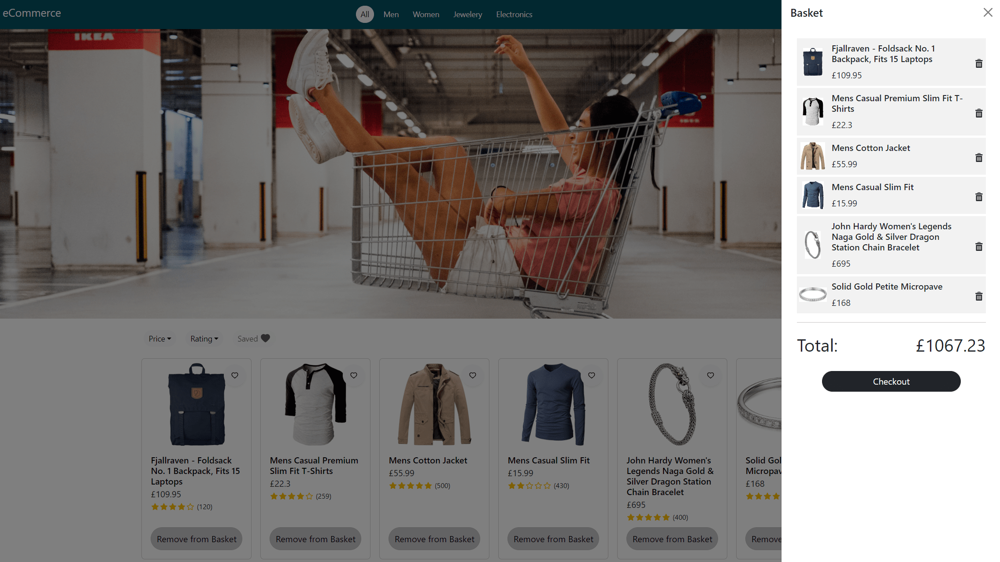
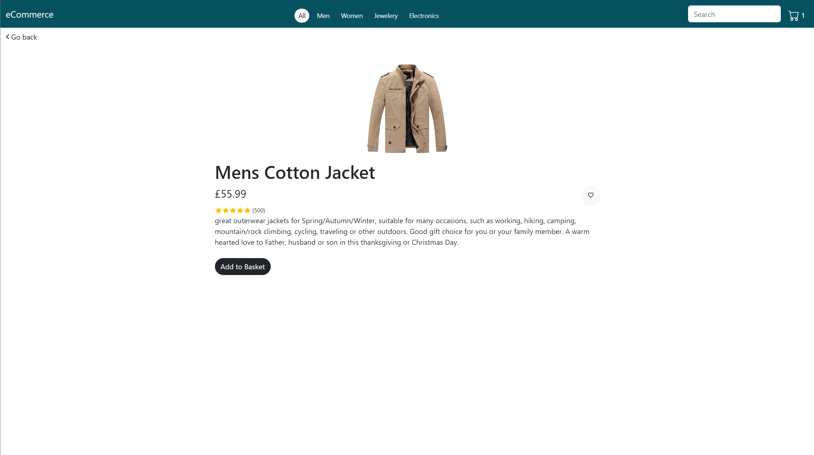
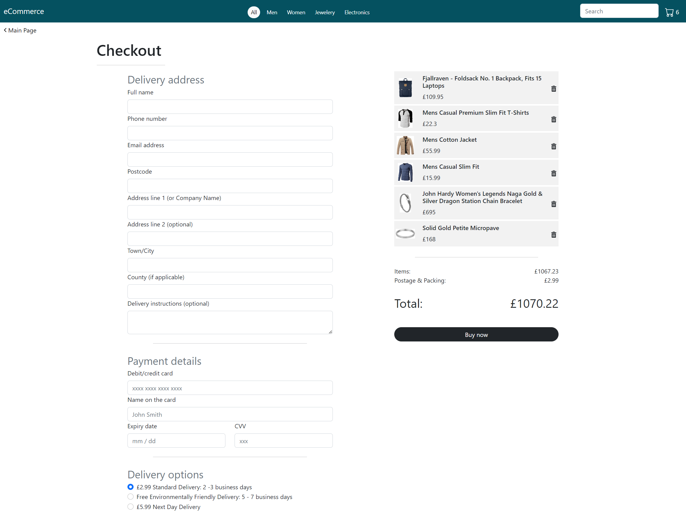
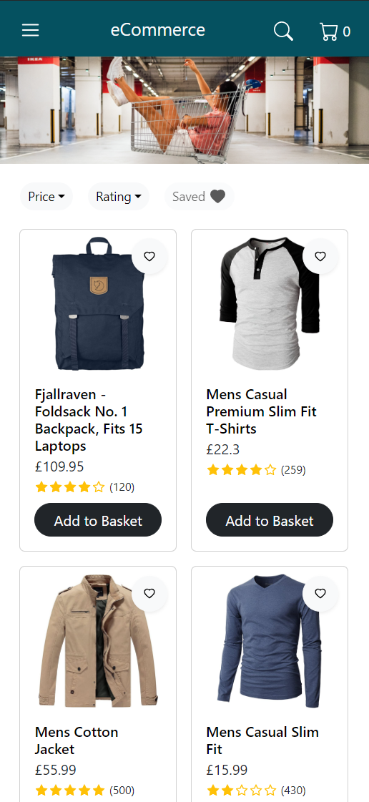
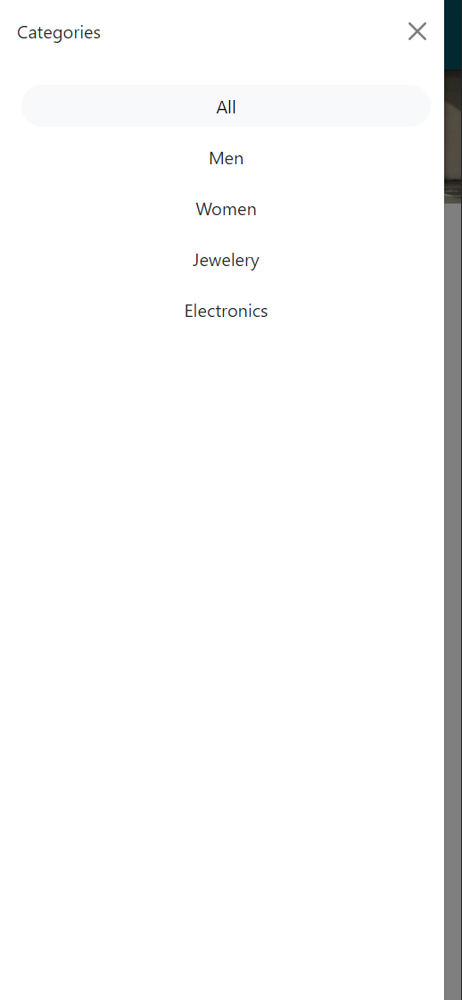
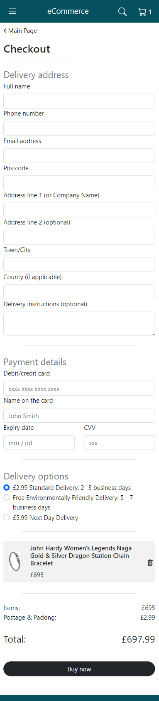

# eCommerce Website in React
This is an ecommerce / shopping cart website with a checkout form built using React and Bootstrap components. It is a single-page app that utilizes React Router to navigate its content. The features include adding items to the basket, filtering by category, price and rating. A user can add items to the *saved* list, as well as look for specific ones by using the search input. 

The content used in the project comes from Fake Store API. Context API together with useReducer hook have been used to access and manipulate the application’s state.

Technologies used:
- React
- React Bootstrap
- JavaScript

You can see the project live [here](https://stunning-kitten-fa4ebe.netlify.app/).

## Desktop view

### Main page

### Basket

### Product page

### Checkout

## Mobile view

### Side navigation

### Checkout
